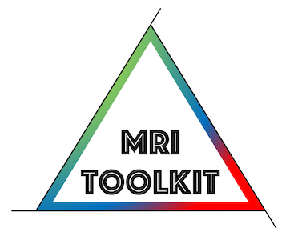

 # MRIToolkit

 ## What is it?
 For my [my research](https://www.isi.uu.nl/people/alberto-de-luca/) I developed a set of scripts and tools to process (diffusion) magnetic resonance imaging (MRI) data, that are (slowly) being integrated in MRIToolkit, a MATLAB (R) toolbox.

## Where do I find it?
[Here](https://github.com/delucaal/MRIToolkit) on Github!

## What can I do with it?
The toolbox is slowly but steadily growing!
###### Ready to use:
- [x] **'LesionEditor'**: a graphical user interface to visualise and edit segmentations of 3D MRI images, originally designed for delineation of multiple-sclerosis lesions on fluid attenuated inversion recovery (FLAIR) images. Requires MATLAB R2018a or newer. **Documentation coming soon**
- [x] **'NiftiIO_basic'**: Basic Nifti input/output, including code originally written by [Jimmy Shen](https://nl.mathworks.com/matlabcentral/fileexchange/8797-tools-for-nifti-and-analyze-image)
- [x] **'DW_basic'**: Utilities to load / manipulate / save dMRI data
- [x] **'OptimizationMethods'**: Classes and functions for numeric optimisation methods
- [x] **'Relaxometry'**: Classes for T1/T2 quantification using inversion-recovery / spin-echo multi-echo data
- [x] **'ThirdParty'**: Utilities from third parties used in other scripts. Includes EPG code from [Brian Hargreaves](http://web.stanford.edu/~bah/software/epg/)
- [x] **'ExploreDTIInterface'**: I am pleased to announce that MRIToolkit now contains, distributes and develops many functions originally developed as part of [ExploreDTI](www.exploredti.com). They are here available as a consolidated library and are planned to also become command line tools. A big thank to [Alexander Leemans](http://providi-lab.org) and Ben Jeurissen for this! 
- [x] **'SphericalDeconvolution'**: Methods used for two novel deconvolution methods we developed, namely the [Generalized Richardson Lucy](https://arxiv.org/abs/1910.05372) and [mFOD](https://www.biorxiv.org/content/10.1101/739136v1). Some of the functions here included have been taken from [Hardi Tools](https://www.neuroimagen.es/webs/hardi_tools/) of Erick Canales-Rodriguez.
- [x] **'ImageRegistrations'**: Image registration utils based on Elastix
- [x] **'Demos'**: Small examples showcasing functionalities of MRIToolkit.
###### Being integrated and coming soon:
- [ ] **'DW_basic'**: Basic data structures / utilities for diffusion MRI data
- [ ] **'Diffusion_basic'**: Class for (basic) dMRI quantification
- [ ] **'DW_IVIMDTDK_I'**: Diffusion MRI fit utilities - IVIM, DT, DKI
- [ ] **'Dicom_utils'**: Tools for handling unconventional or buggy DICOMs
- [ ] **'DW_Laplacian_NNLS'**: Tools for spectral multi-compartment fit (NNLS/L2NNLS/PL2NNLS)
- [ ] **'MixedCodeUtils'**: 'Useful general purpose functions
- [ ] **'MRIfoundation'**: Classes for MRI sequences abstraction
- [ ] **'EPG_simulator'**: Classes for EPG simulations

###### Not yet planned for release:
- **'dfMRI'**,'Diffusion fMRI utilities

###### Working examples:
- **'EPGFitT2Muscle.m'**: in Relaxometry, this function fits bi-exponential T2 (water/fat) with EPG
- **'DESPOT12Fit.m'**: an example script to fit DESPOT1 and DESPOT2 as in [Deoni et al. 2005](https://www.ncbi.nlm.nih.gov/pubmed/15690526)
- **'MultiEchoTFit.m'**: an example script to fit mono-exponential T2 with multi-echo data. More advanced fit approaches (bi-exponential, EPG) will come soon
- **'InversionRecoveryT1Fit.m'**: an example script to fit T1 with inversion recovery data.
- **'CSD_Tractography_Script.m'**: an example script showcasing how to use the ExploreDTIInterface toolbox.
- More examples will come in the next days.

###### Notes:
- The file naming convention is to always indicate Niftis as .nii, even when they are actually compressed in .nii.gz. The code takes care of that, but expects only .nii as arguments in function calls!
- Not everything has been checked yet - expect many bug fixes and new releases in the next time.
- MRIToolkit relies on a couple of third party dependencies:
  - Elastix: 1) Either compile your own version or grab the executables for your platform here. 2) Copy the file "TemplateMRIToolkitDefineLocalVars.m" to your MATLAB default folder (user/MATLAB or Documents/MATLAB), rename the file as "MRIToolkitDefineLocalVars.m". 3) Edit the script, adjusting the variable MRIToolkit.Elastix.Location as needed.
  - NODDI toolbox: if you would like to try the mFOD method, you will need to add the [NODDI toolbox](http://mig.cs.ucl.ac.uk/index.php?n=Tutorial.NODDImatlab) to the MATLAB path.
  - ExploreDTI: While MRIToolkit is entirely self-sufficient (e.g. all needed ExploreDTI functions are bundled and adapted), the visualization of fiber tractograhy and other results will need ExploreDTI. Get it for free from [Alexander Leemans](www.exploredti.com).
- This code is a work in progress. It will be updated without notice to ensure bug-fixes and the inclusion of best available methods
- Most code is poorly commented and not general, but will be improved over releases.

###### License:
- This software is distributed under the LGPLv3 license (https://opensource.org/licenses/lgpl-3.0.html).

###### Keywords:
- Magnetic Resonance Imaging (MRI)
- Image segmentation
- T1 quantification, Inversion Recovery
- T2 quantification, spin echo multi echo
- Extended Phase Graphs
- Diffusion MRI (dMRI) - Diffusion Tensor Imaging (DTI) - Diffusion Kurtosis Imaging (DKI)
- dMRI preprocessing - motion correction - eddy currents correction - EPI distortions correction
- Fiber tractography - Constrained Spherical Deconvolution (CSD) - Generalized Richardson Lucy (GRL) - mFOD

Alberto De Luca - 2019
